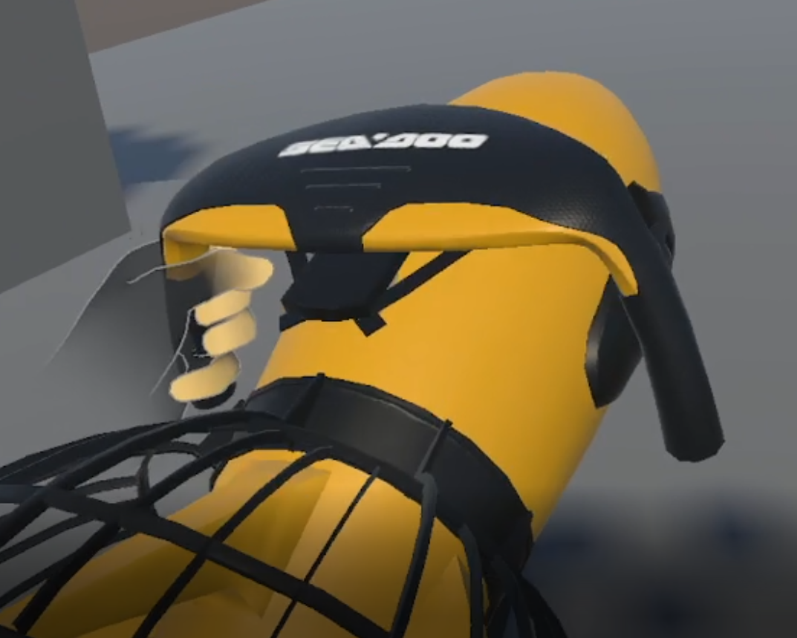
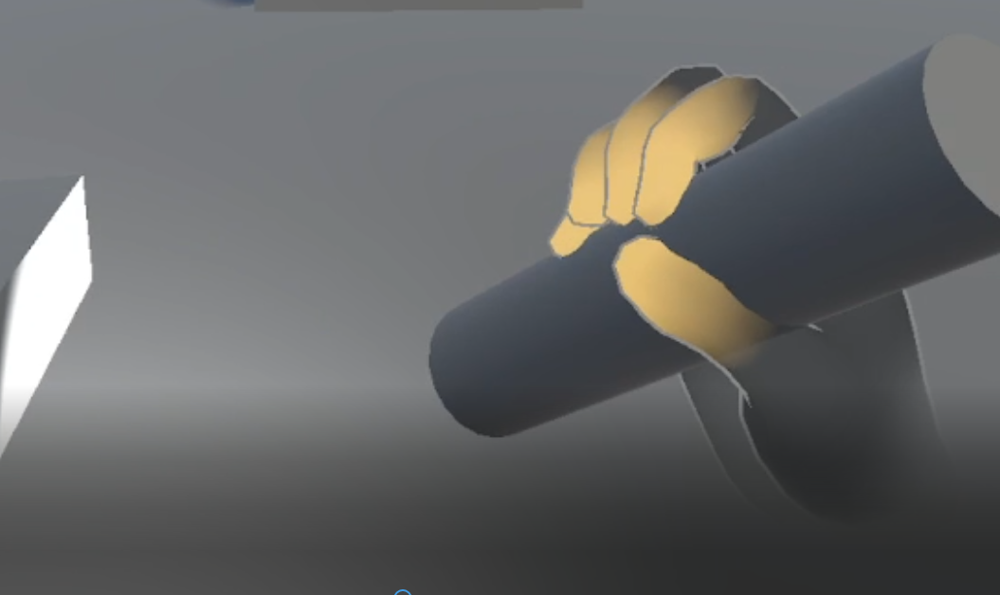
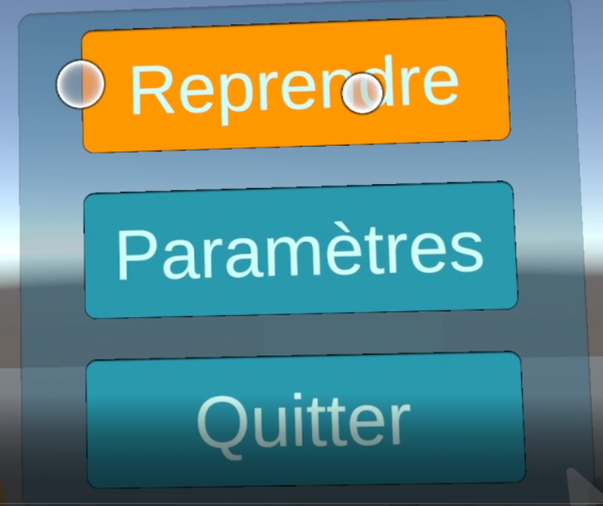
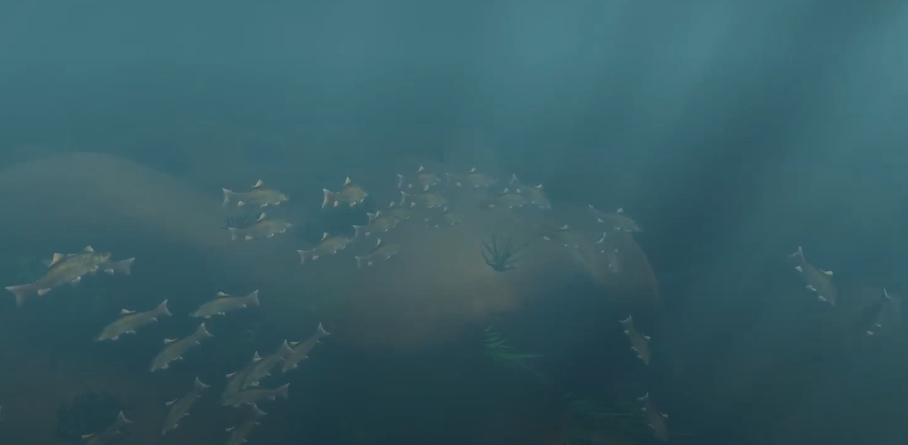
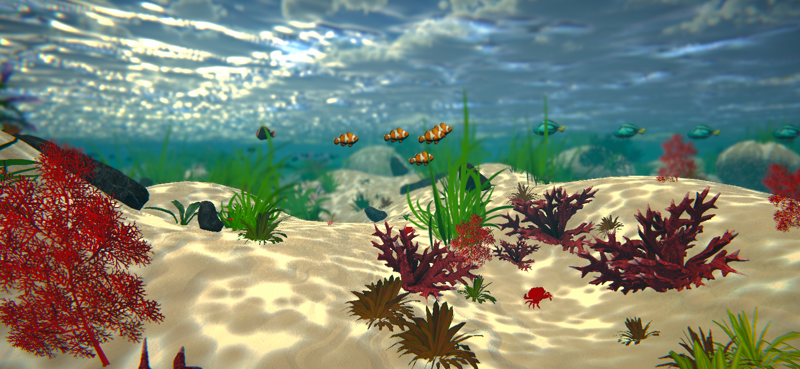

# Projet_subaquatique

Lors de ma première année en master ISICG à Limoges, nous avons travaillé sur la réalisation d'un jeu vidéo d'exploration subaquatique en réalité virtuelle sur Unity.

Ce projet avait déjà été initié deux ans auparavant, les anciens groupes avaient déjà implémenté plusieurs fonctionnalités :

- Génération de terrain de manière procédurale grâce au marching cube
- Différents effets graphiques et textures (tri-planar mapping, god rays, caustiques, rendu de l'eau, etc.)
- Ajout d'une faune aquatique avec un système de Boid pour simuler des bancs de poissons
- Ajout d'une flore

Nous étions un groupe de 4 étudiants, la première étape a été de décider des différentes tâches que nous allions effectuer, nous sommes donc venus avec les idées suivantes:

- Upgrade de la version de Unity
- Changement du pipeline graphique vers URP
- Ajouts de textures de manière procédurale
- Amélioration du comportement de la faune et de la flore
- Améliorer la génération du terrain
- Implémentation de la réalité virtuelle

Pour ma part, je me suis principalement occupé de l'implémentation de la VR grâce au package d'intégration d'Oculus présent dans l'asset store de Unity.
Lors de ce projet, j'ai donc implémenté le joueur, l'interaction avec des objets ainsi que l'interface utilisateur.

Scooter          |  Lampe Torche |  Menu
:-------------------------:|:-------------------------:|:-------------------------:
  |  |  

Avant           |  Après
:-------------------------:|:-------------------------:
  |  
